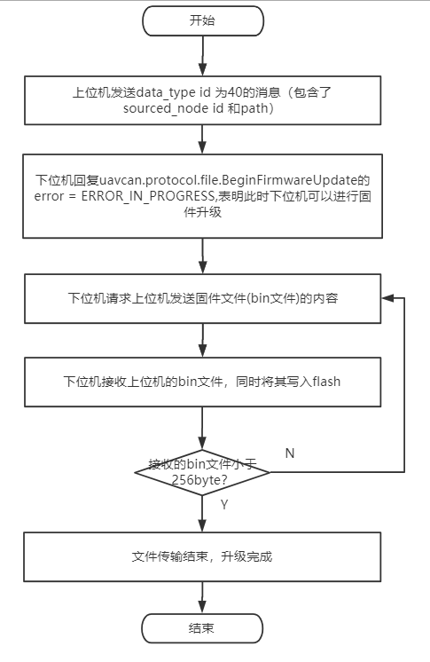

# UAVCAN BootLoader 软件架构书

## 前言

本工程是基于uavcan 固件升级协议所编写的stm32 bootloader程序，读者必须对uavcan动态ID分配以及固件升级协议有所了解，本文也会做简单的介绍，更进一步的协议，读者可以参考 [uavcan  Application_level_functions ](<https://legacy.uavcan.org/Specification/6._Application_level_functions/>)  的 "Dynamic node ID allocation"部分和”Firmware update“部分，

## 1. 动态ID分配过程

动态ID分配的具体过程如下：

1. allocatee (通常是单片机)发送 first part of their unique ID + UID的前6个字节，allocator (通常是上位机)回复  接收的UID的前6个字节；
2. allocatee接收到上位机的**正确回复（UID的前6个字节）**以后，发送 UID的第7到第12个字节，allocator回复接收的UID的前12个字节；
3. allocatee接收到上位机的**正确回复（UID的前12个字节）**以后，发送 UID的第13到第16个字节，allocator回复它给allocatee分配的node_id和接收的UID的16个字节；

具体例子：

```
Time   CAN ID     CAN data field
1.117  1EEE8100   01 44 C0 8B 63 5E 05 C0
1.117  1E000101   00 44 C0 8B 63 5E 05 C0
1.406  1EEBE500   00 F4 BC 10 96 DF 11 C1
1.406  1E000101   05 B0 00 44 C0 8B 63 81
1.406  1E000101   5E 05 F4 BC 10 96 DF 21
1.406  1E000101   11 41
1.485  1E41E100   00 A8 BA 54 47 C2
1.485  1E000101   29 BA FA 44 C0 8B 63 82
1.485  1E000101   5E 05 F4 BC 10 96 DF 22
1.485  1E000101   11 A8 BA 54 47 42

Unique ID	44 C0 8B 63 5E 05 F4 BC 10 96 DF 11 A8 BA 54 47 (hex)
Preferred node ID	0 (any)
Allocated node ID	125
```

备注：uavcan官方协议中提到的随机延时时间，读者可以自行实现。

## 2. 固件升级过程

固件升级的具体过程如下：

1. 上位机发送data_type id 为40的消息（包含了sourced_node id 和path），参考`uavcan.protocol.file.BeginFirmwareUpdate`；
2. 下位机回复`uavcan.protocol.file.BeginFirmwareUpdate`的error = ERROR_IN_PROGRESS，（optional_error_message可以填写任意字符串，或者留空）表明此时下位机可以进行固件升级；
3. 下位机请求上位机发送固件文件(bin文件)的内容，参考`uavcan.protocol.file.Read`；
4. 下位机接收上位机的bin文件，同时将其写入flash；
5. 重复第3和第4步，直到文件读取完毕，升级完成。

其流程图如下：

