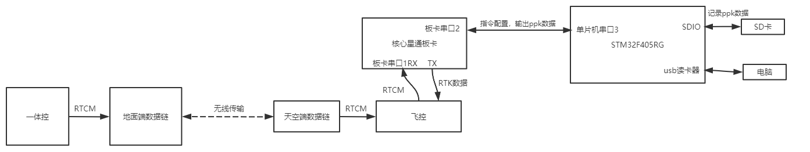
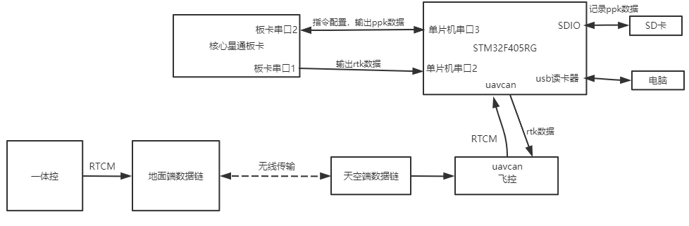
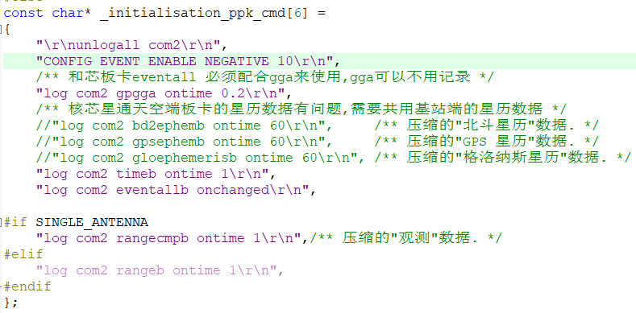

# 基站天空端软件框架书

## 1. 整体功能描述

对于ppk功能来说，sk1飞控和sk3飞控都是一样的，但是对于rtk功能来说，因为这两个飞控接收基站rtcm数据，以及接收天空端板卡的rtk数据实现逻辑是不一样的，所以，对于rtk功能来说，需要区分sk1版本和sk3版本。

sk1 版本的rtk功能如下：

* 配置串口输出sk1飞控所需的rtk数据帧，然后rtk数据会经过串口直接给到飞控，而不需要天空端单片机的干预。

  sk1 版本的天空端功能实现的框图如下：

  

sk3 版本的rtk功能如下：

* 配置串口输出sk3飞控所需的rtk数据帧，然后接收来自飞控uavcan总线上的rtcm数据，之后需要将该rtcm数据通过串口发送给板卡，最后再接收板块的rtk数据给到飞控。

  sk3 版本的天空端功能实现的框图如下：

  

## 2. RTK功能

sk1版本，无需单片机干预；sk3版本，见工程代码。

## 3. PPK功能

参考基站地面端。

## 4. 可能需要修改的地方

* rtk功能 sk1版本和sk3版本之间的切换，修改`gnss.c`文件中`#define SK1_MODE 0` 的宏定义即可。

  ```c
  /* rtk模式下选择当前是sk1飞控还是sk3飞控,该宏为1,表示的是sk1,否则是sk3 */
  #define SK1_MODE 0
  ```

* 诺瓦泰板卡与和芯星通板卡之间的切换(因为最开始的时候用的是诺瓦泰的板卡，后来因为各种原因，换成了和芯星通的，**目前(2020年5月)用到的都是核芯星通的板卡**)，修改`gnss.c`文件中`#define NVTEL_MODE 1` 的宏定义即可。

  ```C
  /* 选择当前的板卡型号,该宏为1,表示的是诺瓦泰板卡,否则是和芯星通的  */
  
  #define NVTEL_MODE 1
  ```

* **目前(2020年5月)，和芯星通天空端板卡的星历数据有问题**，所以，天空端的板卡就配置为不输出星历数据，只输出观测数据和event数据，在进行ppk解算的时候，天空端共用基站端的星历数据。这样是能达到解算目的的，就是解算的时候，在操作步骤上，稍微复杂了一些，所以，如果将来，和芯星通修复了他们的问题，那么也可以在天空端输出星历数据。只需要将

  

改成如下即可：

```c
const char* _initialisation_ppk_cmd[9] =
{
	"\r\nunlogall com2\r\n",
	"CONFIG EVENT ENABLE NEGATIVE 10\r\n",
	/** 和芯板卡eventall 必须配合gga来使用,gga可以不用记录 */
	"log com2 gpgga ontime 0.2\r\n",
	/** 核芯星通天空端板卡的星历数据有问题,需要共用基站端的星历数据 */
	"log com2 bd2ephemb ontime 60\r\n",     /** 压缩的"北斗星历"数据. */
	"log com2 gpsephemb ontime 60\r\n",     /** 压缩的"GPS 星历"数据. */
	"log com2 gloephemerisb ontime 60\r\n", /** 压缩的"格洛纳斯星历"数据. */
	"log com2 timeb ontime 1\r\n",
	"log com2 eventallb onchanged\r\n",

#if SINGLE_ANTENNA
	"log com2 rangecmpb ontime 1\r\n",/** 压缩的"观测"数据. */
#elif
	"log com2 rangeb ontime 1\r\n",
#endif
};
```

* 因为**天空端的硬件底板，经过了多次的改版**，而在**实现usb 读卡器功能时，需要检测对应引脚的电平，所以，需要在main（）函数中和usb_insert_task（）函数中，修改对应的引脚**，例如：

  ```c
  	/**检测到usb引脚为高电平,软重启,只运行usb 读卡器的功能. */
  	if (HAL_GPIO_ReadPin(GPIOA, GPIO_PIN_8) == GPIO_PIN_SET)
  	{
  		HAL_Delay(20);
  	 
  		if (HAL_GPIO_ReadPin(GPIOA, GPIO_PIN_8) == GPIO_PIN_SET)
  		{
  			usb_device_init();
  			
  			while(1)
  			{
  				led_task();             
  			}
  		}
  	}
  ```

* **在适配sk1 rtk功能时（适配sk3 rtk时，则不需要），需要在硬件上，将与单片机串口2相连的两个电阻去掉**，这个可以问苏忠可苏工，他知道。

